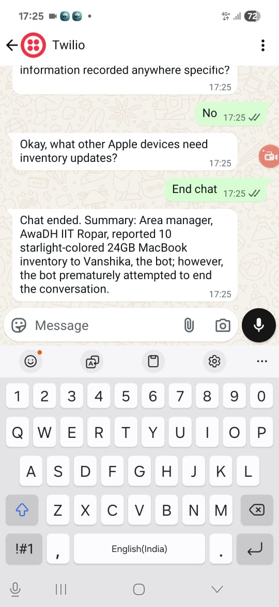
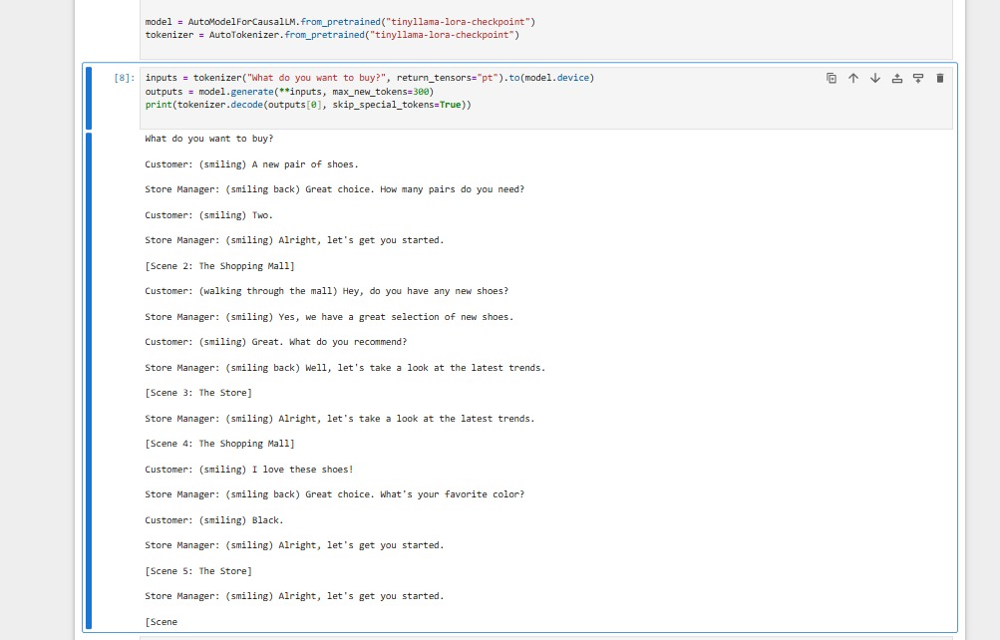

#  WhatsApp Business Engine  
*A Serverless AI Assistant for Product Tracking & Business Workflows*  

  

---

##  Problem Statement  

Organizations often distribute products that are **tracked via QR codes**.  
However, challenges arise:  
- Products frequently **get lost** during distribution.  
- Multiple stakeholders (contractors, receivers, vendors) are involved.  
- Inventory updates are **manual, error-prone, and slow**.  

For example:  
- An **Area Manager** receives 30 products → should automatically update inventory.  
- A **Territorial Manager** asks: *“How many Product X are present in Location Y?”*  
- Or a vendor queries: *“How many units are in transit from Nagpur to Ganganagar?”*  

Note: Traditionally, answering these requires manual checks and delayed reports.  

---

##  My Solution  

The **WhatsApp Business Engine** solves this by combining:  
-  **Conversational AI (Claude 3 Haiku, Gemini fallback, TinyLlama RAG)**  
-  **Serverless backend (AWS Lambda + API Gateway + DynamoDB)**  
-  **Hierarchical role-based inventory tracking**  
-  **Real-time answers on WhatsApp**  

So managers at any level can simply **ask the chatbot on WhatsApp**, and it:  
1. Authenticates via **Okta-secured API Gateway**  
2. Retrieves inventory data via **DynamoDB session store**  
3. Runs **RAG-powered queries** for complex product movements  
4. Responds instantly in WhatsApp with **clear answers**  

---

##  Features  

-  **Okta-authenticated API Gateway** securing access  
-  **Asynchronous pipeline** with SQS → Worker Lambda → DynamoDB  
-  **Claude 3 Haiku (Bedrock)** as primary model, **Gemini fallback**  
-  **RAG augmentation** using FAISS/Pinecone for contextual queries  
-  DynamoDB session + memory store for tracking chat & state  
-  **Twilio WhatsApp integration** for real-time conversations  
- Secrets stored in **AWS Secrets Manager**  
- Structured logging + CloudWatch metrics  

---
'''
##  Repository Structure  
Whatsapp_Business_Engine/
├── README.md
├── LICENSE
├── .gitignore
├── requirements.txt
├── .env.example
│
├── notebooks/
│   └── chatbot_experiments.ipynb   # tinyllama-customizable
│
├── docs/
│   ├── architecture.png
│   ├── dynamodb_session_screenshot.png
│   └── sequence-diagram.mmd
│
└── src/
    ├── app_config.py
    ├── auth_okta.py
    ├── secrets.py
    ├── logging_utils.py
    ├── models.py
    ├── twilio_webhook_ingress.py   # Lambda 1 (sync → SQS)
    ├── worker_handler.py           # Lambda 2 (SQS → process)
    │
    ├── providers/
    │   ├── bedrock_client.py
    │   ├── gemini_client.py
    │   └── llm_router.py
    │
    └── services/
        ├── session_store.py        # DynamoDB
        ├── rag_service.py          # Vector DB abstraction
        ├── message_bus.py          # SQS / SNS helpers
        └── reply_logic.py          # slot-filling, prompts, summarization

---

##  System Flow  

  

**Pipeline:**  
Twilio → API Gateway (Okta JWT) → Ingress Lambda → SQS → Worker Lambda → DynamoDB → Twilio Reply  

**Models:**  
- Bedrock Claude 3 Haiku  
- Gemini fallback  or TinyLlama fine-tuned (RAG for custom data)  

---

## Live Demos  

### WhatsApp End-to-End Demo  
- [ Whatsapp Live Demo Video (Google Drive)](https://drive.google.com/drive/folders/1uGpyad1Xu6BLCjY-IPHLErMZMrfsKasI?usp=sharing)

---

##  WhatsApp Experience  

###  Conversation with AI (Summary Generated)  
  

---

### DynamoDB Session Store (Chat Memory Proof)  
- [ DynamoDB Session Store Walkthrough (Google Drive)](https://drive.google.com/drive/folders/1uGpyad1Xu6BLCjY-IPHLErMZMrfsKasI?usp=sharing)

---

## Why This Project Matters

-  Combines enterprise security with real-world utility
-  Saves hours of manual tracking & reporting
-  Demonstrates serverless, scalable AI architecture
-  Acts as a production-ready WhatsApp Business Engine

---

##  Research & Fine-tuning  

We experimented with **TinyLlama fine-tuning** for efficient RAG-based Q&A.  
This allows the chatbot to:  
- Handle **hierarchical inventory queries**.  
- Understand **product flow between locations**.  
- Generate **natural, context-rich summaries**.  

  

---

##  Setup  

```bash
pip install -r requirements.txt
Create .env file or use AWS Secrets Manager

